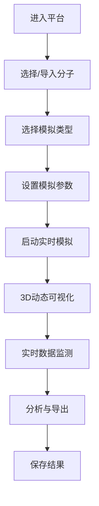

## 1. 产品概述

面向化学和生物科研人员的浏览器端3D分子模拟平台，提供蛋白质折叠、药物-靶点结合、材料性质预测等核心功能，所有计算结果实时可视化展示。

- **主要目的**：让科研人员在浏览器中即可进行复杂的分子模拟和可视化分析，无需安装专业软件
- **解决问题**：降低分子模拟门槛，提供实时交互的3D可视化体验
- **目标用户**：化学、生物、材料科学领域的科研人员和学生
- **市场价值**：推动计算化学和生物信息学的普及，加速新药研发和材料创新

## 2. 核心功能

### 2.1 用户角色

| 角色 | 注册方式 | 核心权限 |
|------|----------|----------|
| 科研用户 | 无需注册，直接使用 | 完整的分子模拟、可视化、数据导出功能 |

### 2.2 功能模块

1. **分子可视化工作台**：3D分子渲染、实时交互、多种显示模式
2. **蛋白质折叠模拟**：折叠过程动态展示、能量变化曲线、结构分析
3. **药物-靶点结合模拟**：分子对接模拟、结合能计算、相互作用可视化
4. **材料性质预测**：晶体结构展示、导电性/弹性模拟、电子云分布
5. **计算结果面板**：结合能、分子轨道、电子云密度等数据实时可视化

### 2.3 页面详情

| 页面名称 | 模块名称 | 功能描述 |
|----------|----------|----------|
| 工作台主页面 | 3D视口 | 分子3D渲染、旋转缩放、剖切视图 |
| 工作台主页面 | 分子库面板 | 预设分子选择、PDB文件导入、结构搜索 |
| 工作台主页面 | 显示模式切换 | 球棍模型、空间填充、带状图、表面模式 |
| 工作台主页面 | 模拟控制面板 | 折叠模拟、对接模拟、材料模拟的参数设置和启动 |
| 工作台主页面 | 实时数据面板 | 能量曲线、结合能、轨道能级、电子云分布 |
| 工作台主页面 | 分析工具 | 距离测量、角度计算、氢键识别 |

## 3. 核心流程

用户进入平台后，从分子库选择或导入分子结构，选择模拟类型（折叠/对接/材料），设置模拟参数，启动实时模拟，观察3D动态变化和数据曲线，最后导出结果数据或截图。

## 4. 用户界面设计

### 4.1 设计风格

- **主色调**：深空蓝 (#0A1628) 作为背景，科技蓝 (#3B82F6) 作为主色，量子紫 (#8B5CF6) 作为强调色
- **辅助色**：原子色编码（碳-灰、氧-红、氮-蓝、氢-白、硫-黄）
- **按钮风格**：微玻璃拟态，圆角8px，微妙的边框发光效果
- **字体**：显示字体使用 Orbitron（科技感），正文字体使用 JetBrains Mono（代码风格）
- **布局风格**：三栏布局，左侧分子库，中间3D视口，右侧数据面板
- **图标风格**：线性图标，配合微妙的发光效果

### 4.2 页面设计概述

| 页面名称 | 模块名称 | UI Elements |
|----------|----------|-------------|
| 工作台 | 3D视口 | 深色背景，分子发光渲染，粒子效果，鼠标悬停高亮 |
| 工作台 | 分子库 | 卡片式网格，缩略图预览，悬停缩放效果 |
| 工作台 | 数据面板 | 半透明玻璃拟态，实时更新图表，渐变色曲线 |
| 工作台 | 控制面板 | 滑动条、开关按钮，参数联动，渐变按钮 |

### 4.3 响应性

- 桌面端优先，三栏固定布局
- 平板端自适应为左右两栏，底部弹出控制面板
- 移动端单栏堆叠，3D视口全屏，支持触摸手势

### 4.4 3D场景指导

- **环境**：深色星空背景，微妙的星云粒子效果
- **光照**：三光源系统（主光+补光+轮廓光），PBR材质渲染
- **相机**：透视相机，支持轨道控制、平移、缩放，自动聚焦分子中心
- **交互**：拖拽旋转、滚轮缩放、双击重置、右键平移
- **动画**：分子默认缓慢自转，模拟时显示动态轨迹线，能量变化粒子效果
- **后处理**：Bloom发光效果，轻微的色差，环境光遮蔽
- **性能**：分子原子数超过1000时自动降级渲染，使用实例化渲染优化
