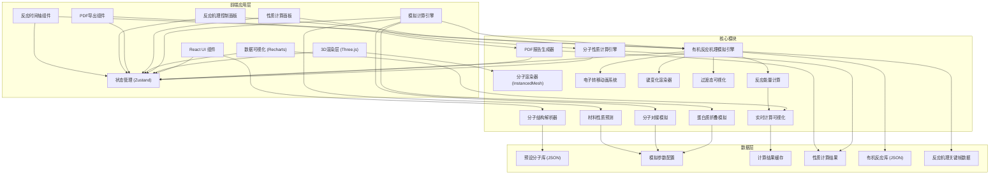
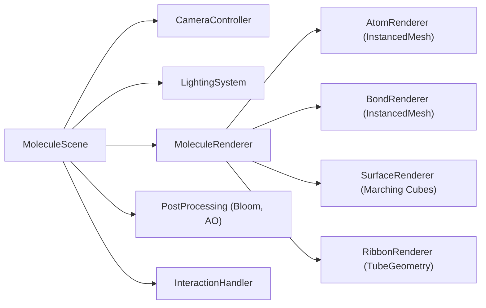
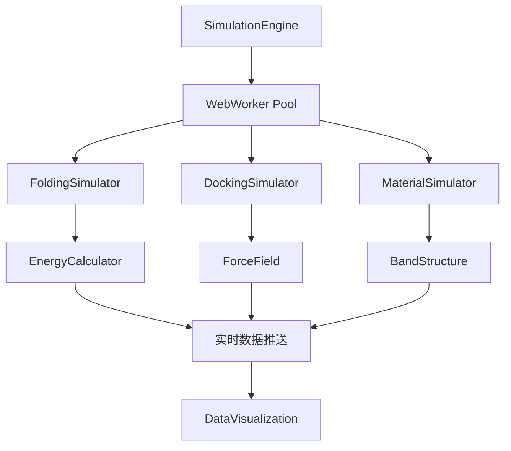
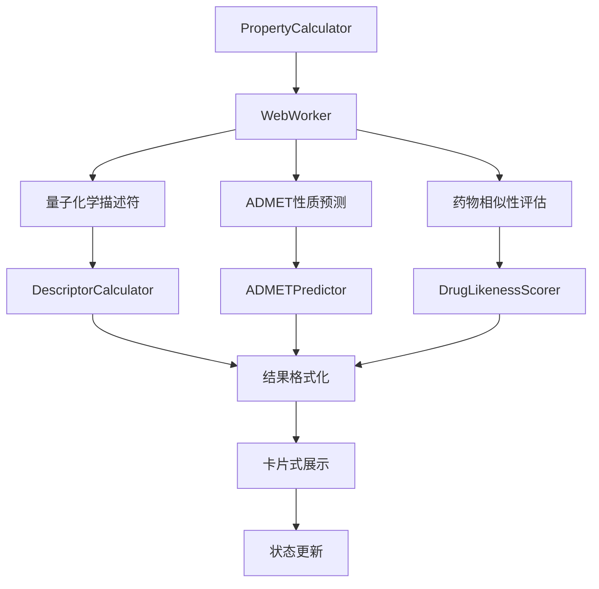
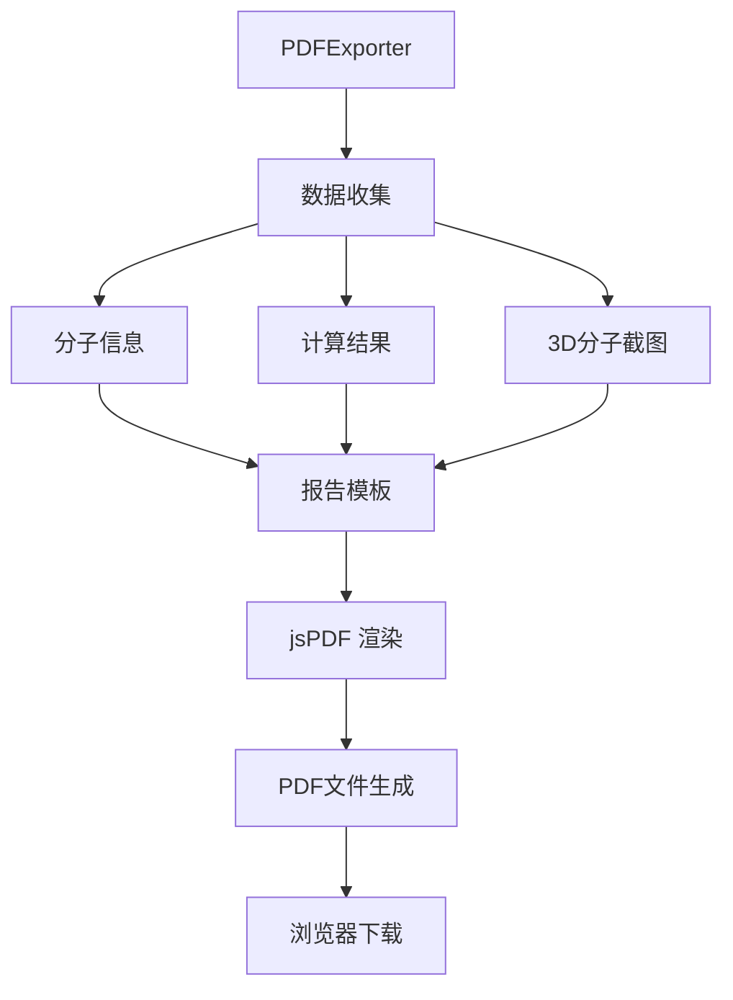
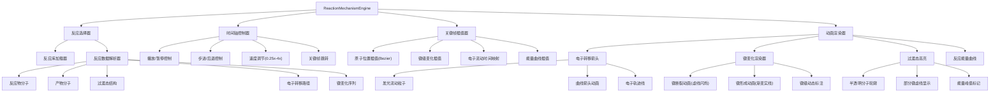
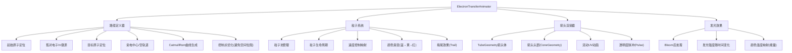
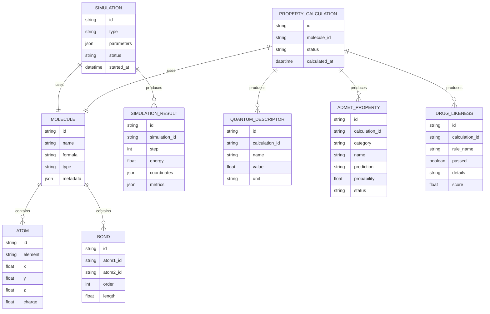

## 1. 架构设计



## 2. 技术描述

- **前端框架**: React@18 + TypeScript + Vite@5
- **3D引擎**: three@0.160 + @react-three/fiber@8 + @react-three/drei@9 + @react-three/postprocessing@2
- **3D动画**: three/addons (TubeGeometry用于箭头动画、CatmullRomCurve3用于轨迹)
- **状态管理**: zustand@4
- **数据可视化**: recharts@2
- **样式方案**: tailwindcss@3 + postcss + autoprefixer
- **动画库**: framer-motion@11
- **图标库**: lucide-react@0.294
- **PDF导出**: jspdf@2 + html2canvas@1
- **化学工具库**: rdkit-js (用于分子描述符计算)
- **动画曲线**: 自定义贝塞尔曲线插值、缓动函数(easeInOutQuad, easeInOutCubic)
- **初始化工具**: vite-init (npm create vite@latest)
- **后端**: None (纯前端应用，计算在浏览器端使用Web Workers)
- **数据库**: LocalStorage 缓存计算结果，内置Mock分子数据和反应机理数据

## 3. 路由定义

| Route | Purpose |
|-------|---------|
| / | 主工作台页面，包含3D视口、分子库、控制面板、数据面板 |

## 4. 核心模块架构

### 4.1 3D渲染模块架构



### 4.2 模拟引擎架构



### 4.3 分子性质计算引擎架构



### 4.4 PDF报告生成器架构



### 4.5 有机反应机理模拟引擎架构



### 4.6 电子转移动画系统架构



## 5. 数据模型

### 5.1 数据模型定义



### 5.2 核心TypeScript类型定义

```typescript
// 原子类型
interface Atom {
  id: string;
  element: string;
  x: number;
  y: number;
  z: number;
  charge?: number;
  residue?: string;
  chain?: string;
}

// 化学键类型
interface Bond {
  id: string;
  atom1: string;
  atom2: string;
  order: 1 | 2 | 3 | 'aromatic';
  length: number;
}

// 分子结构类型
interface Molecule {
  id: string;
  name: string;
  formula: string;
  type: 'protein' | 'small_molecule' | 'material';
  atoms: Atom[];
  bonds: Bond[];
  sequence?: string;
  pdbId?: string;
}

// 显示模式类型
type DisplayMode = 'ball_stick' | 'space_filling' | 'ribbon' | 'surface';

// 模拟类型
type SimulationType = 'folding' | 'docking' | 'material';

// 模拟状态
interface SimulationState {
  isRunning: boolean;
  type: SimulationType | null;
  currentStep: number;
  totalSteps: number;
  energy: number[];
  parameters: SimulationParameters;
}

// 模拟参数
interface SimulationParameters {
  temperature: number;
  timestep: number;
  forceField: string;
  iterations: number;
}

// 计算结果
interface CalculationResult {
  bindingEnergy?: number;
  homoEnergy?: number;
  lumoEnergy?: number;
  bandGap?: number;
  conductivity?: number;
  elasticity?: number;
  electronDensity?: number[][];
  molecularOrbitals?: Orbital[];
}

// 分子轨道
interface Orbital {
  energy: number;
  occupancy: number;
  type: 'HOMO' | 'LUMO' | 'other';
  coefficients: number[];
}

// 计算类型
type PropertyCalculationType = 'quantum' | 'admet' | 'drug_likeness' | 'all';

// 量子化学描述符
interface QuantumDescriptor {
  name: string;
  value: number;
  unit?: string;
  description?: string;
  category: 'electronic' | 'structural' | 'topological' | 'physicochemical';
}

// ADMET分类
type ADMETCategory = 'absorption' | 'distribution' | 'metabolism' | 'excretion' | 'toxicity';

// ADMET性质
interface ADMETProperty {
  name: string;
  category: ADMETCategory;
  prediction: string;
  probability: number;
  status: 'good' | 'moderate' | 'poor' | 'unknown';
  description?: string;
  reference?: string;
}

// 药物相似性规则
interface DrugLikenessRule {
  ruleName: string;
  passed: boolean;
  score: number;
  details: string;
  threshold?: string;
}

// 药物相似性评估结果
interface DrugLikenessResult {
  overallScore: number;
  rules: DrugLikenessRule[];
  summary: string;
}

// 性质计算状态
interface PropertyCalculationState {
  isCalculating: boolean;
  selectedTypes: PropertyCalculationType[];
  quantumDescriptors: QuantumDescriptor[] | null;
  admetProperties: ADMETProperty[] | null;
  drugLikeness: DrugLikenessResult | null;
  error: string | null;
  calculatedAt: Date | null;
}

// PDF导出配置
interface PDFExportConfig {
  includeMoleculeInfo: boolean;
  includeQuantum: boolean;
  includeADMET: boolean;
  includeDrugLikeness: boolean;
  include3DScreenshot: boolean;
  pageSize: 'a4' | 'letter';
}

// 有机反应类型
type ReactionType = 'SN2' | 'E2' | 'SN1' | 'E1' | 'nucleophilic_addition' | 'elimination' | 'electrophilic_substitution' | 'diels_alder' | 'grignard' | 'hydrolysis' | 'esterification';

// 电子转移类型
type ElectronTransferType = 'lone_pair_to_bond' | 'bond_to_lone_pair' | 'bond_to_bond' | 'lone_pair_to_lone_pair';

// 键变化类型
type BondChangeType = 'break' | 'form' | 'change_order';

// 电子转移路径
interface ElectronTransfer {
  id: string;
  type: ElectronTransferType;
  fromAtom: string;
  toAtom: string;
  fromBond?: string;
  toBond?: string;
  startTime: number;
  endTime: number;
  color: string;
  curvePoints: { x: number; y: number; z: number }[];
  electronCount: number;
}

// 键变化
interface BondChange {
  id: string;
  type: BondChangeType;
  atom1: string;
  atom2: string;
  startTime: number;
  endTime: number;
  initialOrder: number;
  finalOrder: number;
  isTransitionState?: boolean;
}

// 反应关键帧
interface ReactionKeyframe {
  time: number;
  label: string;
  type: 'reactant' | 'transition_state' | 'intermediate' | 'product';
  atoms: { id: string; x: number; y: number; z: number }[];
  bonds: { atom1: string; atom2: string; order: number }[];
  energy: number;
  isHighlighted?: boolean;
}

// 反应能量数据点
interface EnergyPoint {
  time: number;
  energy: number;
  label?: string;
  type: 'reactant' | 'transition_state' | 'intermediate' | 'product';
}

// 有机反应机理数据
interface ReactionMechanism {
  id: string;
  name: string;
  type: ReactionType;
  description: string;
  chemicalEquation: string;
  reactants: Molecule[];
  products: Molecule[];
  keyframes: ReactionKeyframe[];
  electronTransfers: ElectronTransfer[];
  bondChanges: BondChange[];
  energyProfile: EnergyPoint[];
  activationEnergy: number;
  reactionEnthalpy: number;
  conditions?: {
    solvent?: string;
    temperature?: string;
    catalyst?: string;
  };
  notes?: string;
}

// 反应机理模拟状态
interface ReactionSimulationState {
  isRunning: boolean;
  currentReaction: ReactionMechanism | null;
  currentTime: number;
  totalDuration: number;
  playbackSpeed: number;
  isPaused: boolean;
  currentKeyframe: number;
  showElectronFlow: boolean;
  showTransitionStates: boolean;
  showEnergyCurve: boolean;
  showBondChanges: boolean;
}

// 动画粒子
interface AnimationParticle {
  id: string;
  position: { x: number; y: number; z: number };
  velocity: { x: number; y: number; z: number };
  color: string;
  size: number;
  life: number;
  maxLife: number;
  trail: { x: number; y: number; z: number }[];
}
```

## 6. 性能优化策略

1. **3D渲染优化**: 使用 InstancedMesh 批量渲染原子和化学键，减少Draw Call
2. **计算优化**: 密集型计算使用 Web Workers，避免阻塞UI线程
3. **性质计算优化**: 分子描述符计算缓存，避免重复计算；增量计算支持
4. **PDF生成优化**: 流式生成PDF，大报告分块处理；Canvas截图压缩
5. **LOD策略**: 根据距离自动切换分子显示精度
6. **内存管理**: 及时释放Geometry和Material，避免内存泄漏
7. **帧率控制**: 模拟计算帧率与渲染帧率分离，确保流畅体验
8. **状态管理优化**: 使用 Zustand selectors 减少不必要的重渲染
9. **反应动画优化**: 预计算所有关键帧插值数据，避免运行时重复计算
10. **粒子系统优化**: 使用对象池管理电子流动粒子，限制最大粒子数量（≤50）
11. **曲线插值优化**: 使用CatmullRomCurve3预计算路径点，运行时直接采样
12. **后处理优化**: 电子转移效果单独渲染层，只在需要时启用Bloom效果
13. **关键帧缓存**: 反应机理数据和插值结果缓存到LocalStorage，避免重复解析
