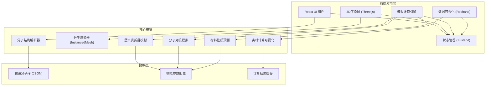
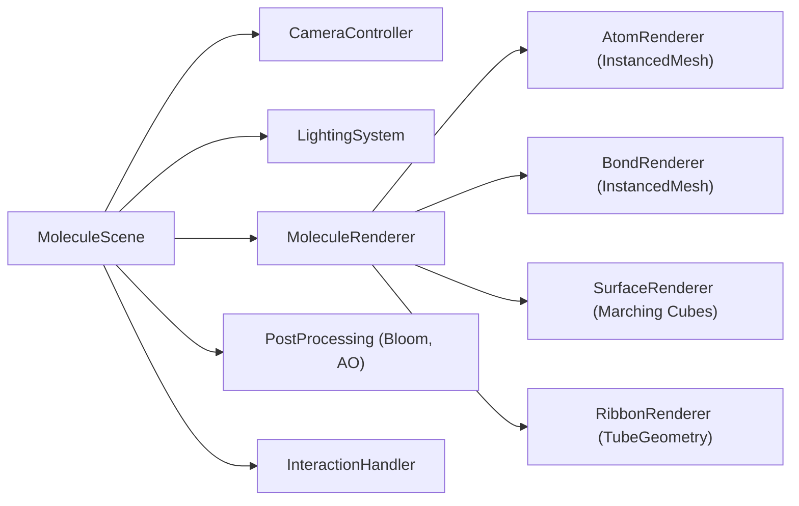
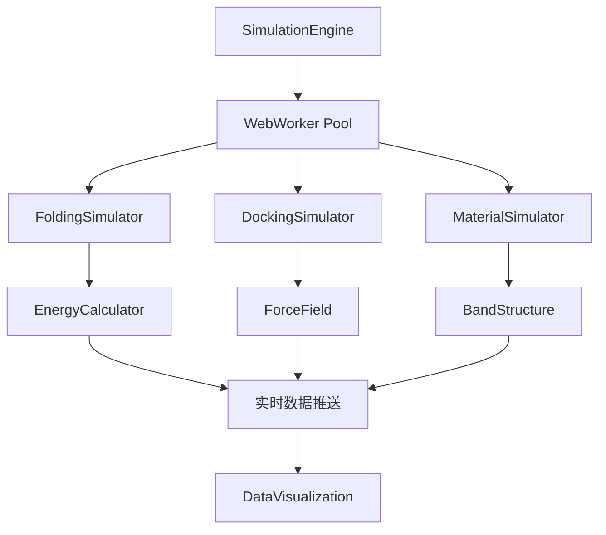
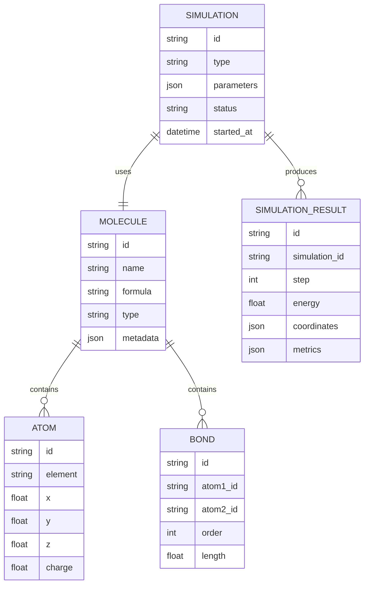

## 1. 架构设计



## 2. 技术描述

- **前端框架**: React@18 + TypeScript + Vite@5
- **3D引擎**: three@0.160 + @react-three/fiber@8 + @react-three/drei@9 + @react-three/postprocessing@2
- **状态管理**: zustand@4
- **数据可视化**: recharts@2
- **样式方案**: tailwindcss@3 + postcss + autoprefixer
- **动画库**: framer-motion@11
- **图标库**: lucide-react@0.294
- **初始化工具**: vite-init (npm create vite@latest)
- **后端**: None (纯前端应用，计算在浏览器端使用Web Workers)
- **数据库**: LocalStorage 缓存计算结果，内置Mock分子数据

## 3. 路由定义

| Route | Purpose |
|-------|---------|
| / | 主工作台页面，包含3D视口、分子库、控制面板、数据面板 |

## 4. 核心模块架构

### 4.1 3D渲染模块架构



### 4.2 模拟引擎架构



## 5. 数据模型

### 5.1 数据模型定义



### 5.2 核心TypeScript类型定义

```typescript
// 原子类型
interface Atom {
  id: string;
  element: string;
  x: number;
  y: number;
  z: number;
  charge?: number;
  residue?: string;
  chain?: string;
}

// 化学键类型
interface Bond {
  id: string;
  atom1: string;
  atom2: string;
  order: 1 | 2 | 3 | 'aromatic';
  length: number;
}

// 分子结构类型
interface Molecule {
  id: string;
  name: string;
  formula: string;
  type: 'protein' | 'small_molecule' | 'material';
  atoms: Atom[];
  bonds: Bond[];
  sequence?: string;
  pdbId?: string;
}

// 显示模式类型
type DisplayMode = 'ball_stick' | 'space_filling' | 'ribbon' | 'surface';

// 模拟类型
type SimulationType = 'folding' | 'docking' | 'material';

// 模拟状态
interface SimulationState {
  isRunning: boolean;
  type: SimulationType | null;
  currentStep: number;
  totalSteps: number;
  energy: number[];
  parameters: SimulationParameters;
}

// 模拟参数
interface SimulationParameters {
  temperature: number;
  timestep: number;
  forceField: string;
  iterations: number;
}

// 计算结果
interface CalculationResult {
  bindingEnergy?: number;
  homoEnergy?: number;
  lumoEnergy?: number;
  bandGap?: number;
  conductivity?: number;
  elasticity?: number;
  electronDensity?: number[][];
  molecularOrbitals?: Orbital[];
}

// 分子轨道
interface Orbital {
  energy: number;
  occupancy: number;
  type: 'HOMO' | 'LUMO' | 'other';
  coefficients: number[];
}
```

## 6. 性能优化策略

1. **3D渲染优化**: 使用 InstancedMesh 批量渲染原子和化学键，减少Draw Call
2. **计算优化**: 密集型计算使用 Web Workers，避免阻塞UI线程
3. **LOD策略**: 根据距离自动切换分子显示精度
4. **内存管理**: 及时释放Geometry和Material，避免内存泄漏
5. **帧率控制**: 模拟计算帧率与渲染帧率分离，确保流畅体验
